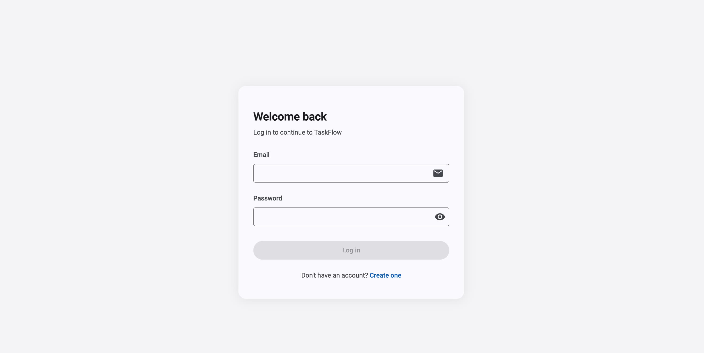
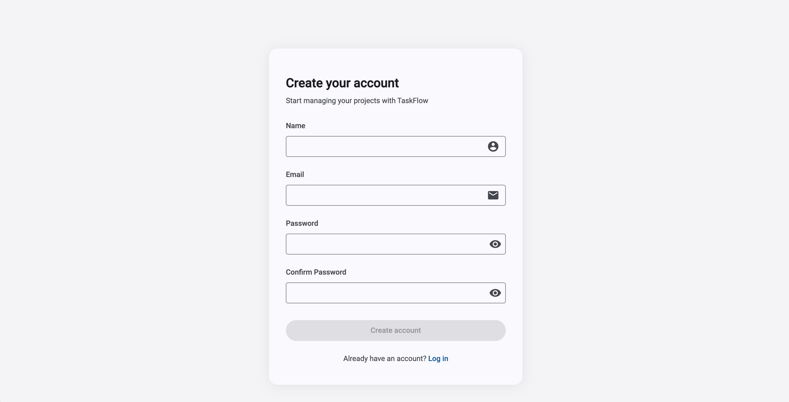
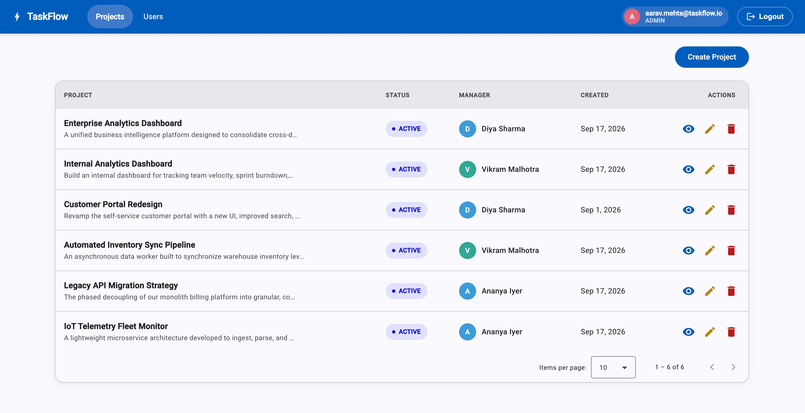
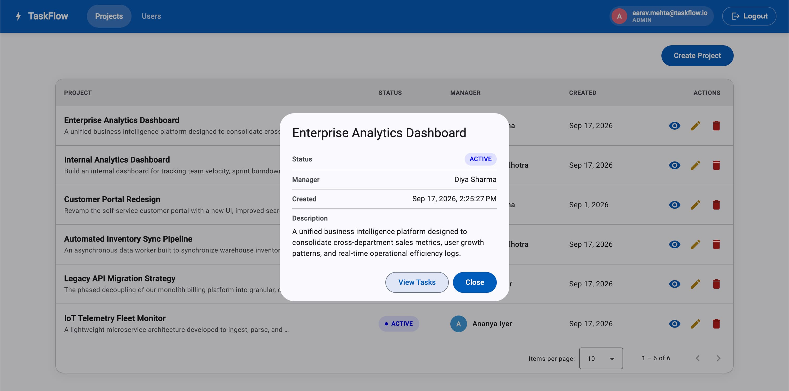
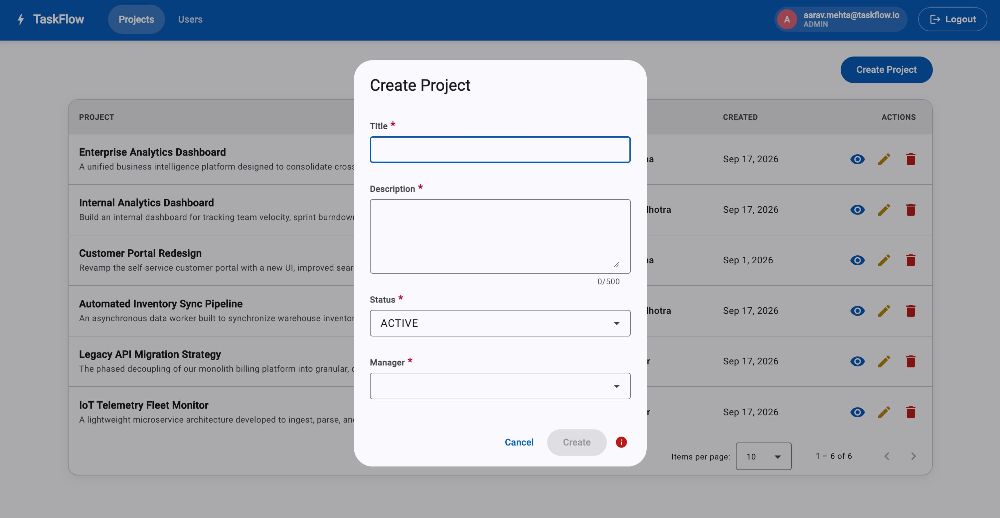
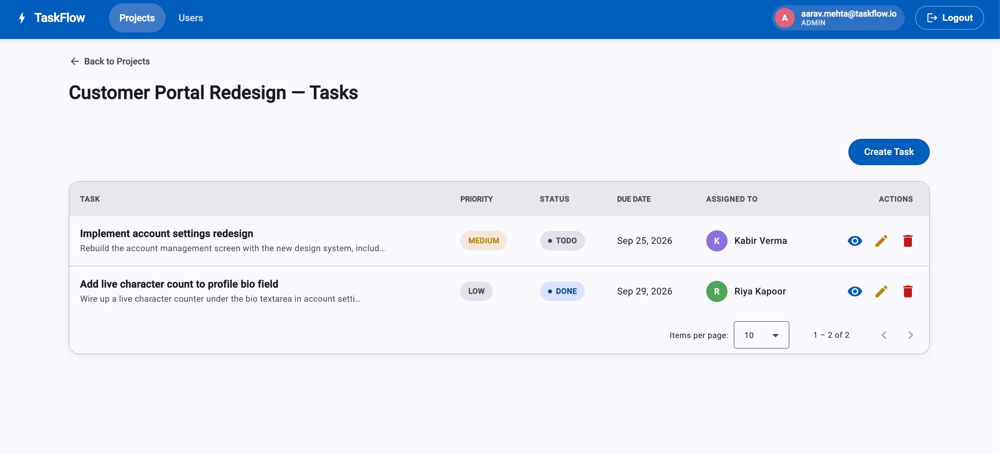
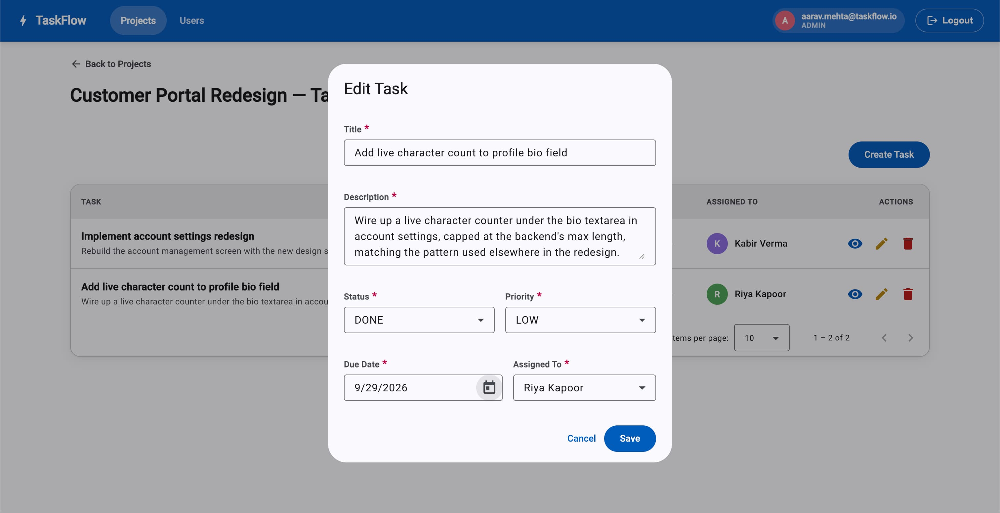
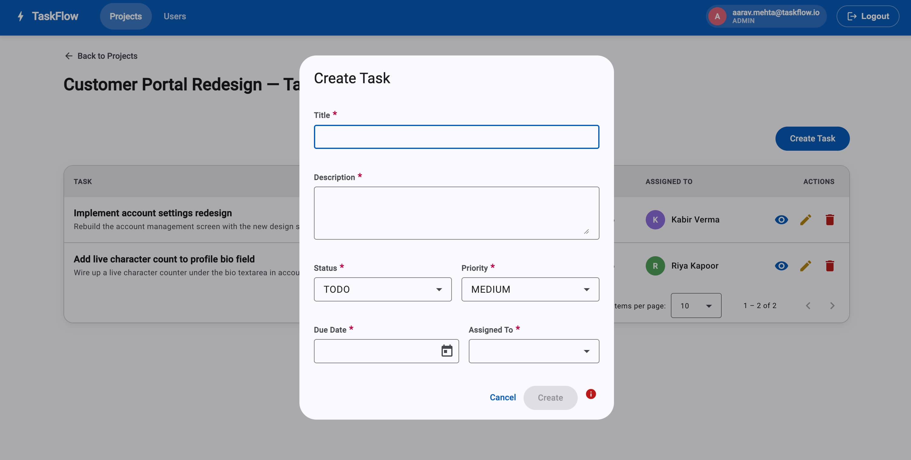
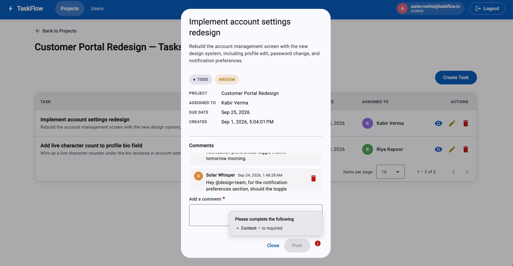
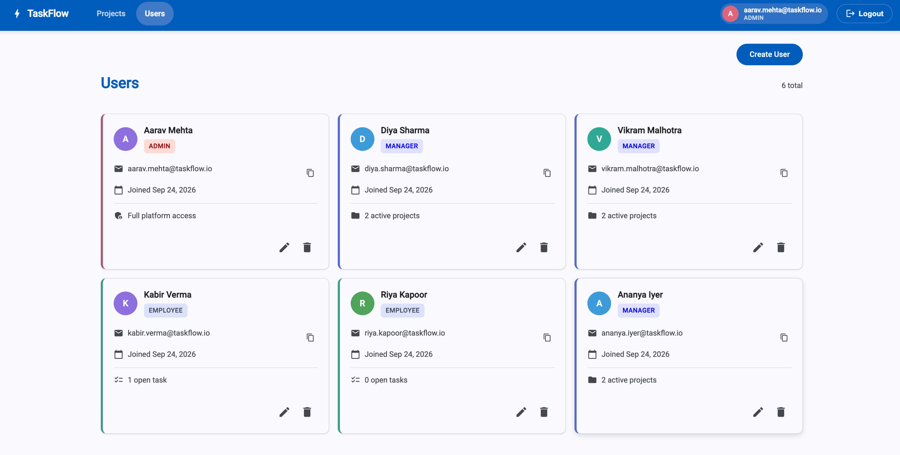

<div align="center">

# ✅ TaskFlow

**A role-based project & task management system — Spring Boot REST API + Angular dashboard.**

Admins, Managers and Employees each see and do only what their role and ownership allow, enforced on the server, not just hidden in the UI.

*Built end-to-end to showcase senior full-stack engineering: JWT auth with rotating refresh tokens, method-level authorization with ownership checks, strict DTO boundaries, and a signal-based Angular frontend.*

---


</div>

---

## Table of Contents

- [Architecture](#architecture)
- [Tech Stack](#tech-stack)
- [Features](#features)
- [Roles & Permission Matrix](#roles--permission-matrix)
- [Gallery](#gallery)
- [Project Structure](#project-structure)
- [Getting Started](#getting-started)
- [API Reference](#api-reference)
- [Security Model](#security-model)
- [Testing](#testing)
- [Key Engineering Decisions](#key-engineering-decisions)

---

## Architecture

```
┌────────────────────┐        HTTPS + Bearer JWT        ┌─────────────────────────────┐
│  Angular 22 (SPA)  │ ───────────────────────────────▶ │  Spring Boot 3.5 REST API   │
│  Signals · Material│ ◀─────────────────────────────── │  Controller → Service → Repo│
│  Guards · Interc.  │        JSON (DTOs only)          └──────────┬───────────┬──────┘
└────────────────────┘                                             │           │
                                                        JPA / SQL  │           │  refresh:{userId}
                                                                   ▼           ▼
                                                            ┌────────────┐ ┌─────────┐
                                                            │ PostgreSQL │ │  Redis  │
                                                            └────────────┘ └─────────┘
```

### How a request flows

1. **Login** — `POST /api/auth/login` is authenticated the classic way: `AuthenticationManager` → `CustomUserDetailsService` → BCrypt comparison. This is the only step that touches the database for credentials.
2. **Tokens issued** — a signed 15-minute **access JWT** (`sub`, `userId`, `role` claims) and an opaque 7-day **refresh token** stored in Redis as `refresh:{userId}`.
3. **Every later request** — `JwtAuthenticationFilter` verifies the signature and expiry, builds the principal straight from the claims, and populates `SecurityContextHolder`. **No DB call per request.**
4. **Authorization** — `@PreAuthorize` on the service implementation evaluates role and ownership (e.g. `@projectSecurity.isOwner(#id, authentication)`) before the method body runs.
5. **Failure modes are distinct** — missing/invalid/expired token → **401** (`JwtAuthenticationEntryPoint`, filter layer). Valid token but insufficient role/ownership → **403** (`AccessDeniedException`, handled by `GlobalExceptionHandler`). Both return the same `ErrorResponse` JSON shape.
6. **Silent refresh** — on a 401, the Angular interceptor calls `/api/auth/refresh` once (even if many requests fail concurrently), rotates the refresh token, and retries the queued requests.

---

## Tech Stack

| Layer | Technology |
|---|---|
| Backend | Java 21, Spring Boot 3.5, Spring Security, Spring Data JPA |
| Auth | JWT access tokens (15 min) + Redis-backed opaque refresh tokens with rotation and revocation |
| Database | PostgreSQL |
| Cache / token store | Redis |
| Password hashing | BCrypt |
| Frontend | Angular 22, Angular Material (M3 theme), SCSS |
| State | Angular Signals |
| Forms | Classic Reactive Forms, custom + async validators |
| Client JWT parsing | `jwt-decode` |
| API testing | Postman ([100-case role/ownership matrix](docs/postman-test-plan.md)) |

---

## Features

### 🔐 Authentication & Sessions
| | Feature | Detail |
|---|---|---|
| 🔑 | **JWT access tokens** | 15-minute expiry, `userId` and `role` embedded as claims so requests need no DB lookup |
| ♻️ | **Rotating refresh tokens** | Opaque UUID in Redis with 7-day TTL; every refresh issues a new token and kills the old one |
| 🚪 | **Instant logout** | `DEL` on the Redis key revokes the refresh token immediately |
| 🔄 | **Silent refresh in the SPA** | Interceptor refreshes on 401 with a shared in-flight guard — N concurrent 401s cause exactly one refresh call |
| ⚡ | **Cold-boot session restore** | `provideAppInitializer` restores a session from a live refresh token after a hard reload, bounded by a 5s timeout |

### 🛡️ Authorization
| | Feature | Detail |
|---|---|---|
| 👥 | **Three roles** | `ADMIN`, `MANAGER`, `EMPLOYEE` with a full permission matrix (below) |
| 🏷️ | **Ownership checks** | Manager A can never modify Manager B's project — role alone is never enough |
| 🎯 | **Least-privilege endpoints** | Employees get a narrow `PATCH /tasks/{id}/status` instead of the full `PUT` |
| 🕵️ | **Existence hiding** | `GET /projects/{id}` returns **404** (not 403) for projects you can't access, so IDs can't be probed |

### 📋 Projects, Tasks & Comments
| | Feature | Detail |
|---|---|---|
| 📁 | **Projects** | Create, edit, view, delete, paginated list — scoped server-side by role |
| ✅ | **Tasks** | Assign to employees, priority, due date, status workflow, pagination + sorting by due date/priority |
| 💬 | **Comments** | Post/view/delete with asymmetric permissions; history survives author deletion via a denormalized `authorName` snapshot |
| 👤 | **Users (admin)** | Card-based directory with role-conditional derived stats (active projects / open tasks), batch-fetched to avoid N+1 |

### 🎨 Frontend Experience
| | Feature | Detail |
|---|---|---|
| 🧭 | **Guards** | `AuthGuard`, `RoleGuard` on parent routes protect whole subtrees |
| 📝 | **Reactive forms** | Cross-field validator (password match), async validator (`check-email`), custom past-date validator, live character counts |
| 🧩 | **FormPulse** | Reusable form-validation-summary component driven by a shared error-message registry |
| ⏳ | **Global loading bar** | Signal-based active-request counter fed by a functional interceptor |
| 🔔 | **Notifications** | 403 shows a snackbar instead of redirecting — the user is logged in, just lacks permission |

---

## Roles & Permission Matrix

| Action | ADMIN | MANAGER | EMPLOYEE |
|---|---|---|---|
| Create / delete users | ✅ | ❌ | ❌ |
| View all users | ✅ full | ✅ summary only | ❌ |
| Create / update / delete project | ✅ | ✅ own projects only | ❌ |
| View projects | all | own projects | projects containing their tasks |
| Create / assign task | ✅ | ✅ within own projects | ❌ |
| Update task status | ✅ | ✅ own projects | ✅ only their assigned task, status field only |
| Full task edit / delete | ✅ | ✅ own projects | ❌ |
| View tasks | all | own projects' tasks | only tasks assigned to them |

> The backend independently rejects unauthorized calls with **403**. Hiding buttons in Angular is a UX nicety, never the security boundary. Every cell of this matrix is exercised by the [Postman test plan](docs/postman-test-plan.md).

---

## Gallery

### Login & Register
> Reactive forms with inline errors after `touched || dirty`, async email-taken check and password-mismatch validation.




### Projects
> Role-aware project list with pagination, create/edit dialog and delete confirmation.





### Tasks
> Task list per project with status, priority and due date and comments; employees see only their own tasks.






### Users (Admin)
> Card directory with role-colored edge, avatar, and derived stats.



---

## Project Structure

```
TaskFlow/
├── Backend/                              # Spring Boot REST API
│   ├── src/main/java/com/taskflow/backend/
│   │   ├── config/                       # SecurityConfig (filter chain, CORS, method security)
│   │   ├── controller/                   # Auth, User, Project, Task, Comment controllers
│   │   ├── dto/
│   │   │   ├── request/                  # Validated request DTOs
│   │   │   └── response/                 # Response DTOs (no entity ever leaves the service layer)
│   │   ├── entity/                       # User, Project, Task, Comment
│   │   ├── enums/                        # Role, ProjectStatus, TaskStatus, TaskPriority
│   │   ├── exception/                    # GlobalExceptionHandler, ErrorResponse, custom exceptions
│   │   ├── repository/                   # Spring Data JPA repositories
│   │   │   └── projection/               # Grouped-count projections for batch-fetched stats
│   │   ├── security/                     # JwtUtil, JwtAuthenticationFilter, EntryPoint,
│   │   │                                 # CustomUserDetails(+Service), RefreshTokenService,
│   │   │                                 # ProjectSecurity / TaskSecurity / CommentSecurity beans
│   │   └── service/                      # Service interfaces
│   │       └── impl/                     # Implementations (@PreAuthorize lives here)
│   ├── src/main/resources/application.yaml
│   ├── scripts.sql                       # Schema / seed script
│   └── pom.xml
│
├── taskflow-frontend/                    # Angular 22 SPA
│   └── src/app/
│       ├── core/
│       │   ├── auth/                     # AuthService, AuthInterceptor, AuthGuard, RoleGuard
│       │   ├── config/                   # API base-URL injection token
│       │   ├── loading/                  # LoadingService + loading interceptor
│       │   └── models/                   # Typed API models and enums
│       ├── features/
│       │   ├── auth-ui/                  # login, register, unauthorized
│       │   ├── projects/                 # list, create/edit, view dialog, access guard
│       │   ├── tasks/                    # list, edit dialog, view dialog, date validators
│       │   ├── comments/                 # comment-section (embedded in task view)
│       │   ├── users/                    # admin card list, user card, edit dialog
│       │   └── not-found/                # 404 page at the wildcard route
│       ├── layout/
│       │   ├── shell/                    # Authenticated chrome + global progress bar
│       │   └── nav/                      # Role-aware navigation, identity chip
│       └── shared/                       # confirm-dialog, form-pulse, avatar-color, notification
│
├── docs/
│   ├── postman-test-plan.md              # 100-case role/ownership test matrix
│   └── screenshots/                      # UI screenshots used in this README
│
├── .env.example                          # Required/optional environment variables
└── README.md
```

---

## Getting Started

### Prerequisites

- Java 21
- Node.js 22
- PostgreSQL running locally
- Redis running locally

### 1. Clone the repo

```bash
git clone https://github.com/harshkhatri11/taskflow-fullstack.git
cd taskflow-fullstack
```

### 2. Create the database

```bash
createdb taskFlow
psql -d taskFlow -f Backend/scripts.sql
```

### 3. Configure environment

Spring Boot does **not** read `.env` files by itself. Set these as real environment variables (IntelliJ Run Configuration, shell `export`, or your container runtime). `.env.example` documents them.

| Variable | Required | Default | Purpose |
|---|---|---|---|
| `TASKFLOW_DB_USERNAME` | ✅ | — | PostgreSQL user |
| `TASKFLOW_DB_PASSWORD` | ✅ | — | PostgreSQL password |
| `TASKFLOW_JWT_SECRET` | ✅ | — | Base64 HS256 signing key (32+ bytes). Generate: `openssl rand -base64 48` |
| `TASKFLOW_DB_HOST` | | `localhost` | |
| `TASKFLOW_DB_PORT` | | `5432` | |
| `TASKFLOW_DB_NAME` | | `taskFlow` | |
| `TASKFLOW_REDIS_HOST` | | `localhost` | |
| `TASKFLOW_REDIS_PORT` | | `6379` | |
| `TASKFLOW_JWT_ACCESS_EXPIRY_MS` | | `900000` | 15 minutes |
| `TASKFLOW_JWT_REFRESH_EXPIRY_DAYS` | | `7` | |
| `TASKFLOW_CORS_ALLOWED_ORIGINS` | | `http://localhost:4200` | |

Secrets have **no defaults on purpose** — the app fails at startup if they're missing rather than silently signing tokens with a fallback key.

### 4. Run the backend

```bash
cd Backend
export TASKFLOW_DB_USERNAME=... TASKFLOW_DB_PASSWORD=... TASKFLOW_JWT_SECRET=...
./mvnw spring-boot:run
```

### 5. Run the frontend

```bash
cd taskflow-frontend
npm install
ng serve
```

### 6. Access the app

| Service | URL |
|---|---|
| Angular app | http://localhost:4200 |
| REST API | http://localhost:8080/api |

> There is no self-service path to `ADMIN`. Bootstrap the first admin by inserting a row (or seed via `scripts.sql`), then create other users from the admin UI.

---

## API Reference

### Auth (public)

| Method | Endpoint | Description |
|---|---|---|
| `POST` | `/api/auth/register` | Register — role is always `EMPLOYEE`; any `role` in the body is ignored |
| `POST` | `/api/auth/login` | Returns `accessToken`, `refreshToken`, `expiresIn`, `role` |
| `POST` | `/api/auth/refresh` | Rotates the refresh token, returns a new pair |
| `POST` | `/api/auth/logout` | Revokes the refresh token |
| `GET` | `/api/auth/check-email` | `{ exists: boolean }` — backs the async validator |

### Users

| Method | Endpoint | Access |
|---|---|---|
| `GET` | `/api/users` | ADMIN (full), MANAGER (summary fields only) |
| `POST` | `/api/users` | ADMIN |
| `DELETE` | `/api/users/{id}` | ADMIN |
| `GET` | `/api/users/me` | Any authenticated |

### Projects

| Method | Endpoint | Access |
|---|---|---|
| `GET` | `/api/projects` | Scoped server-side by role |
| `GET` | `/api/projects/{id}` | Per matrix — **404** if not accessible |
| `POST` | `/api/projects` | ADMIN, MANAGER (`managerId` server-controlled for managers) |
| `PUT` | `/api/projects/{id}` | ADMIN, owning MANAGER — **403** otherwise |
| `DELETE` | `/api/projects/{id}` | ADMIN, owning MANAGER |

### Tasks

| Method | Endpoint | Access |
|---|---|---|
| `GET` | `/api/projects/{projectId}/tasks` | Scoped by role; supports `page`, `size`, `sort` |
| `POST` | `/api/projects/{projectId}/tasks` | ADMIN, owning MANAGER — assignee must be a valid `EMPLOYEE` |
| `PUT` | `/api/tasks/{id}` | ADMIN, owning MANAGER |
| `PATCH` | `/api/tasks/{id}/status` | ADMIN, owning MANAGER, assigned EMPLOYEE — status field only |
| `DELETE` | `/api/tasks/{id}` | ADMIN, owning MANAGER |

### Comments

| Method | Endpoint | Access |
|---|---|---|
| `GET` | `/api/tasks/{taskId}/comments` | Anyone with access to the task's project |
| `POST` | `/api/tasks/{taskId}/comments` | ADMIN, owning MANAGER, assigned EMPLOYEE |
| `DELETE` | `/api/comments/{commentId}` | Author, owning MANAGER, or ADMIN |

### Error Responses

Every error — validation, 401, 403, 404 — uses one shape:

```json
{
  "timestamp": "2026-09-28T10:15:30.123Z",
  "status": 400,
  "message": "Validation failed",
  "path": "/api/projects",
  "errors": {
    "title": "must not be blank"
  }
}
```

`errors` appears on validation failures only. 401s are written by `JwtAuthenticationEntryPoint` (the filter layer sits outside `@RestControllerAdvice`), 403/404 by `GlobalExceptionHandler` — same JSON either way.

---

## Security Model

| Concern | Approach |
|---|---|
| Password storage | BCrypt; hash never appears in any response DTO |
| Session | Stateless; JWT verified per request without a DB round-trip |
| Token theft window | Access token lives 15 min; refresh token revocable instantly via Redis `DEL` |
| Authorization | `@PreAuthorize` with dedicated security beans for ownership (`@projectSecurity`, `@taskSecurity`, `@commentSecurity`) |
| Mass assignment | Server-controlled fields (`role` on register, `managerId` for managers) are never client-supplied |
| Enumeration | Same generic message for wrong password and unknown email; 404 instead of 403 on project reads |
| Secrets | Injected via environment; no fallback signing key; startup fails loudly if unset |
| CORS | Allowed origins come from config, not hardcoded |
| Known trade-off | Access/refresh tokens are kept in `localStorage`; XSS exposure is documented and accepted for this project |

---

## Testing

The backend is verified against a **100-case Postman matrix** run with five identities: `admin`, `managerA`, `managerB`, `employee1` (assigned), `employee2` (unassigned).

📄 **Full test plan: [`docs/postman-test-plan.md`](docs/postman-test-plan.md)** — every case lists the token used, the target resource, and the expected status code, so it can be replayed request by request or turned into a Postman collection with status assertions.

| Phase | What it proves |
|---|---|
| Auth | Register ignores `role`; login errors leak nothing; 401 body shape matches `ErrorResponse`; refresh rotation kills the old token; logout revokes |
| Users | Admin gets full objects, manager gets summary fields, employee gets 403 |
| Projects | Manager A sees only Project A; non-owner gets **404** on read but **403** on write |
| Tasks | Employee can `PATCH` status on their own task but gets **403** on `PUT`/`DELETE` even for that same task |
| Comments | Viewing is broad, posting is narrow — an unassigned employee in the same project can read but not write |
| Cross-cutting | No entities serialized directly; identical error shape across 400/401/403/404; missing `JWT_SECRET` fails startup |

---

## Key Engineering Decisions

### 🔧 Backend

| Decision | Why |
|---|---|
| **Gate vs. scope authorization** | Yes/no questions ("may this caller do this?") are gates — `@PreAuthorize` plus a security bean. "Which rows may this caller see?" are scopes — an inline `switch` on role inside the service that shapes the query. Mixing them makes one annotation carry two jobs. |
| **`@PreAuthorize` on the implementation, not the interface** | Ties to Spring's default CGLIB proxying and keeps the guard next to the code it protects. |
| **Ownership checks, not just role checks** | `hasRole('MANAGER')` alone would let any manager edit any project. A small `@Component` called from SpEL answers "does this manager own this resource?" |
| **Separate narrow `PATCH /status` endpoint** | Least privilege at the API design level: employees can flip status but can't rewrite title, description or assignment, even on their own task. |
| **404 on project read, 403 on project write** | Reads hide existence so IDs can't be probed; writes to something you can already see fail loudly with 403. The asymmetry is deliberate and covered by tests. |
| **DTOs at every boundary** | Entities are never serialized. Server-controlled fields never appear on request DTOs, which closes mass-assignment holes by construction. |
| **Opaque refresh tokens in Redis** | A refresh call always does a server-side lookup anyway, so a JWT would add signing/parsing complexity for no benefit — and opaque tokens can be revoked instantly. |
| **JWT filter never rejects, only identifies** | The filter leaves `SecurityContextHolder` empty on failure; Spring's access-control layer then routes to the entry point. Keeps "who are you?" and "may you?" cleanly separate. |
| **Batch-fetched derived stats** | `managedProjectCount` / `assignedTaskCount` come from two grouped queries, never a query per row — no N+1. |
| **Hard-delete users + denormalized snapshots** | Keeps the literal `DELETE` contract. `Comment.authorName` preserves history after an author is removed; soft-delete was considered and rejected as a bigger deviation than needed. |
| **`open-in-view: false`** | No lazy loading leaking into the web layer; forces explicit fetching in the service. |

### 🎨 Frontend

| Decision | Why |
|---|---|
| **Signals over `BehaviorSubject`** | Current-user and list state are plain signals; simpler reads, no subscription management. |
| **Classic Reactive Forms** | Mature validator and error model; async and cross-field validators are first-class. |
| **Service owns HTTP, components don't** | Components stay presentational and testable. |
| **Guards on parent routes** | One `authGuard` on the shell protects the whole subtree; `roleGuard` gates only `/users`. |
| **Shared in-flight refresh guard** | Concurrent 401s queue behind one `/auth/refresh` call instead of racing and invalidating each other's rotated tokens. |
| **Boot restore ≠ mid-session refresh** | `restoreSession()` and the interceptor's 401 handler are independent code paths for independent lifecycle moments. A timeout leaves tokens untouched (unknown), an explicit 401/400 clears them (dead). |
| **403 → snackbar, 401 → refresh/redirect** | Matches what each status actually means for a logged-in user. |
| **No dedicated project-detail route** | The create/edit and view dialogs cover it; row actions never navigate away from the list. |

---

## Author

<table>
  <tr>
    <td>
      
    </td>
    <td>
      <strong>Harsh Khatri</strong><br/>
      Full-Stack Software Engineer · 5+ years<br/>
      Spring Boot · Angular · Redis · PostgreSQL · Docker<br/>
      <br/>
      <a href="https://github.com/harshkhatri11">🐙 GitHub</a> &nbsp;·&nbsp;
      <a href="https://www.linkedin.com/in/harshk11/">💼 LinkedIn</a>
    </td>
  </tr>
</table>

> *Built end-to-end as a practice project mirroring a real senior-level assessment — secure API design, role and ownership enforcement, and a resilient Angular client.*